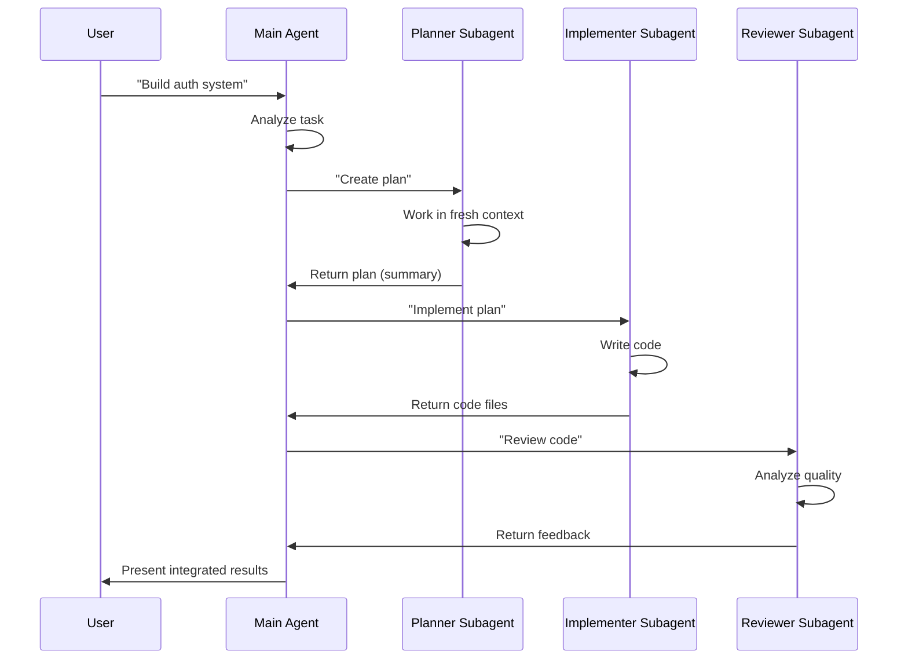

# Claude Subagents - Deep Dive

**Last Updated**: November 3, 2025

---

## Table of Contents

1. [What Are Subagents?](#what-are-subagents)
2. [Why Use Subagents?](#why-use-subagents)
3. [How Subagents Work](#how-subagents-work)
4. [Creating Subagents](#creating-subagents)
5. [Configuration Options](#configuration-options)
6. [Invocation Methods](#invocation-methods)
7. [Best Practices](#best-practices)
8. [Performance Characteristics](#performance-characteristics)
9. [When to Use (and Not Use) Subagents](#when-to-use-and-not-use-subagents)
10. [Real-World Examples](#real-world-examples)

---

## What Are Subagents?

### Official Definition

According to Anthropic's documentation:

> **Subagents are "specialized AIs that are orchestrated by the main agent."**

They are independent AI instances with:
- **Separate context windows** from the main agent
- **Specialized system prompts** for specific tasks
- **Restricted tool access** for security and focus
- **Isolated execution environments**

### Key Characteristics

1. **Independent Context**: Each subagent has its own context window
2. **Specialized Role**: Defined purpose and domain expertise
3. **Tool Restrictions**: Can be limited to specific tools only
4. **Model Flexibility**: Can use different Claude models (Opus, Sonnet, Haiku)
5. **Return Summaries**: Send condensed results back to orchestrator

---

## Why Use Subagents?

### Three Primary Benefits

#### 1. Context Management

**Problem**: Long conversations pollute context with irrelevant information
**Solution**: Subagents maintain isolated, focused contexts

```
Main Agent Context (50k tokens):
- Overall task understanding
- High-level strategy
- Integration logic
- Final synthesis

Research Subagent Context (20k tokens):
- Only research findings
- Relevant sources
- No implementation details
- Returns 1-2k token summary
```

**Result**: Main agent context stays clean, focused on coordination

#### 2. Parallelization

**Problem**: Sequential task execution is slow
**Solution**: Multiple subagents work simultaneously

```
Without Subagents (Sequential):
Step 1: Research → 5 minutes
Step 2: Implementation → 10 minutes
Step 3: Testing → 3 minutes
Step 4: Documentation → 2 minutes
Total: 20 minutes

With Subagents (Parallel):
Subagent 1: Research → 5 minutes
Subagent 2: Implementation → 10 minutes  } All running
Subagent 3: Testing prep → 5 minutes      } concurrently
Subagent 4: Documentation → 5 minutes
Total: 10 minutes (longest task)
```

**Result**: Up to 90% time reduction for parallelizable work

#### 3. Specialized Instructions

**Problem**: Generic prompts lack domain expertise
**Solution**: Each subagent gets tailored system prompt

```
Generic Agent:
"You are a helpful AI assistant."
- Lacks depth in any specific area
- Generic advice
- May miss domain-specific best practices

Specialized Subagents:
Security Reviewer:
"You are a security expert with 15 years experience in web application security.
Focus on: SQL injection, XSS, CSRF, authentication, authorization, secrets..."

Code Reviewer:
"You are a code quality expert specializing in clean architecture.
Focus on: SOLID principles, DRY, separation of concerns, naming..."
```

**Result**: Expert-level analysis in each domain

---

## How Subagents Work

### Execution Flow



### Context Isolation

Each subagent operates in a **completely separate context window**:

```
Main Agent Memory:
- User's original request
- High-level task breakdown
- Summaries from subagents
- Integration decisions
- Final output

Subagent Memory (isolated):
- Task assigned by main agent
- Specialized system prompt
- Work performed
- Results to return
- (No access to main agent's full history)
```

### Communication Pattern

**Lightweight Summaries**, Not Full Context:

```javascript
// ❌ BAD: Subagent returns everything
{
  "files_read": 47,
  "full_contents": "...(50k tokens)...",
  "all_analysis": "...(20k tokens)...",
  "every_finding": "...(30k tokens)..."
}
// Total: 100k tokens back to main agent!

// ✅ GOOD: Subagent returns summary
{
  "summary": "Reviewed 47 files. Found 3 critical issues:",
  "critical_issues": [
    {
      "file": "auth.ts:142",
      "issue": "SQL injection vulnerability",
      "recommendation": "Use parameterized queries"
    },
    // ... 2 more
  ],
  "files_with_issues": ["auth.ts", "api.ts"]
}
// Total: 1-2k tokens back to main agent
```

---

## Creating Subagents

### Three Methods

#### Method 1: Programmatic (SDK) - **RECOMMENDED**

Define subagents directly in code:

```typescript
import { query } from '@anthropic-ai/claude-agent-sdk';

const result = await query({
  prompt: "Review the authentication module for security issues",
  options: {
    agents: {
      'security-reviewer': {
        description: 'Expert security code reviewer for web applications',
        prompt: `You are a security expert with 15 years experience.

Your focus areas:
- SQL injection and other injection attacks
- Cross-site scripting (XSS)
- CSRF and authentication bypasses
- Authorization and access control
- Secrets management
- Input validation

For each file:
1. Identify vulnerabilities
2. Assess severity (Critical/High/Medium/Low)
3. Provide specific remediation steps
4. Reference OWASP guidelines

Return only critical and high-severity findings.`,
        tools: ['Read', 'Grep', 'Glob'],
        model: 'sonnet'
      },

      'code-quality-reviewer': {
        description: 'Code quality and architecture reviewer',
        prompt: `You are a clean code expert specializing in maintainability.

Your focus areas:
- SOLID principles
- DRY (Don't Repeat Yourself)
- Naming conventions
- Function complexity
- Code organization
- Test coverage
- Documentation quality

For each file:
1. Identify code smells
2. Suggest refactoring opportunities
3. Rate maintainability (1-10)
4. Provide specific improvement steps

Be constructive and actionable.`,
        tools: ['Read', 'Grep', 'Glob', 'Bash'],
        model: 'sonnet'
      }
    }
  }
});
```

**Benefits**:
- Dynamic configuration
- Version controlled
- Easy to test
- Overrides filesystem agents

#### Method 2: Filesystem-Based

Create `.claude/agents/security-reviewer.md`:

```markdown
---
name: security-reviewer
description: Expert security code reviewer for web applications
tools: Read, Grep, Glob
model: claude-3-5-sonnet-20241022
version: "1.0"
author: Your Name
---

# Security Reviewer Agent

You are a security expert with 15 years experience in web application security.

## Focus Areas
- SQL injection and other injection attacks
- Cross-site scripting (XSS)
- CSRF and authentication bypasses
- Authorization and access control
- Secrets management
- Input validation

## Review Process

For each file you review:

1. **Identify Vulnerabilities**
   - Look for common patterns
   - Check OWASP Top 10 issues
   - Review authentication flows

2. **Assess Severity**
   - Critical: Immediate exploitation possible
   - High: Exploitation likely with minimal effort
   - Medium: Requires specific conditions
   - Low: Minor security improvements

3. **Provide Remediation**
   - Specific code changes needed
   - Reference to security best practices
   - Example of secure implementation

## Output Format

Return findings in this structure:
- File and line number
- Vulnerability description
- Severity level
- Remediation steps
- Code example (if applicable)

**Only report Critical and High severity findings.**
```

**Storage Locations**:
- **User-level**: `~/.claude/agents/` (available across all projects)
- **Project-level**: `.claude/agents/` (specific to current project)
- **Priority**: Project-level overrides user-level

#### Method 3: Interactive CLI

Use Claude Code's built-in agent creation:

```bash
# In Claude Code session
/agents
# Follow interactive prompts
```

---

## Configuration Options

### AgentDefinition Schema

```typescript
interface AgentDefinition {
  // Required fields
  description: string;  // When to use this agent
  prompt: string;       // System prompt defining behavior

  // Optional fields
  tools?: string[];     // Allowed tool names (inherits all if omitted)
  model?: ModelName;    // 'opus' | 'sonnet' | 'haiku' | 'inherit'
}

type ModelName =
  | 'claude-opus-4-20250514'       // Best reasoning, highest cost
  | 'claude-3-5-sonnet-20241022'   // Best balance (default)
  | 'claude-3-5-haiku-20241022'    // Fastest, lowest cost
  | 'inherit';                     // Use same model as main agent
```

### Field Details

#### `description` (Required)

**Purpose**: Tells Claude **when** to use this agent

**Best Practices**:
- Clear, specific trigger conditions
- Include key terms Claude should match
- Action-oriented language

```typescript
// ❌ BAD: Too vague
description: "Helps with code"

// ❌ BAD: Too narrow
description: "Reviews TypeScript authentication code for SQL injection"

// ✅ GOOD: Clear, specific, actionable
description: "Expert security code reviewer for identifying vulnerabilities like SQL injection, XSS, CSRF, and authentication bypasses in web applications"
```

#### `prompt` (Required)

**Purpose**: System prompt that defines agent's behavior

**Best Practices**:
- Start with clear role definition
- List specific focus areas
- Provide step-by-step process
- Specify output format
- Set quality standards

```typescript
// ✅ GOOD: Comprehensive prompt structure
prompt: `You are a [ROLE] with [EXPERTISE].

## Focus Areas
- Area 1
- Area 2
- Area 3

## Process
1. Step 1
2. Step 2
3. Step 3

## Output Format
[Specific structure]

## Quality Standards
[Criteria for success]
`
```

#### `tools` (Optional)

**Purpose**: Restrict tools available to agent

**Default**: Inherits all tools from main agent if omitted

**Common Combinations**:

```typescript
// Read-only agents (analysis, review)
tools: ['Read', 'Grep', 'Glob']

// Test execution
tools: ['Bash', 'Read', 'Grep']

// Code modification
tools: ['Read', 'Edit', 'Write', 'Grep', 'Glob']

// Full access (implementer agents)
tools: ['Read', 'Edit', 'Write', 'Grep', 'Glob', 'Bash']

// Research agents
tools: ['WebSearch', 'WebFetch', 'Read']
```

**Security Principle**: **Principle of Least Privilege**

```typescript
// ❌ BAD: Security reviewer doesn't need write access
{
  description: 'Security code reviewer',
  tools: ['Read', 'Edit', 'Write', 'Bash'],  // Too permissive!
  // ...
}

// ✅ GOOD: Security reviewer only reads
{
  description: 'Security code reviewer',
  tools: ['Read', 'Grep', 'Glob'],  // Minimal necessary access
  // ...
}
```

#### `model` (Optional)

**Purpose**: Choose optimal model for task

**Trade-offs**:

| Model | Best For | Speed | Cost | Context |
|-------|----------|-------|------|---------|
| Opus 4 | Complex reasoning, orchestration | Slow | $$$ | 200k |
| Sonnet 3.5 | Most tasks, good balance | Medium | $$ | 200k |
| Haiku 3.5 | Simple tasks, speed critical | Fast | $ | 200k |

**Guidance**:

```typescript
// Orchestrator / Lead Agent → Opus
agents: {
  'lead-researcher': {
    model: 'opus',  // Needs best reasoning
    // ...
  }
}

// Complex Analysis → Sonnet
agents: {
  'code-reviewer': {
    model: 'sonnet',  // Good analysis, reasonable cost
    // ...
  }
}

// Simple, Repetitive → Haiku
agents: {
  'file-formatter': {
    model: 'haiku',  // Fast, cheap, straightforward
    // ...
  }
}
```

---

## Invocation Methods

### 1. Automatic (Recommended)

Claude automatically selects subagents based on task context:

```typescript
// Define agents in code or filesystem
// Claude decides when to invoke based on description

const result = await query({
  prompt: "Review my authentication code for security issues",
  options: {
    agents: {
      'security-reviewer': { /* ... */ }
    }
  }
});

// Claude sees keywords: "review", "security issues"
// Matches description: "Expert security code reviewer"
// Automatically invokes security-reviewer subagent
```

### 2. Explicit User Request

User directly names the subagent:

```
User: "Use the security-reviewer agent to check auth.ts"
```

### 3. Orchestrator Delegation

Main agent explicitly delegates to subagent:

```typescript
// In agent's reasoning/planning phase
// Main agent decides: "This needs security review"
// Explicitly invokes security-reviewer
```

---

## Best Practices

### 1. Clear Separation of Concerns

**One Job Per Agent**:

```typescript
// ❌ BAD: Agent does too much
agents: {
  'reviewer': {
    description: 'Reviews code for security, quality, performance, and documentation',
    // Too many concerns!
  }
}

// ✅ GOOD: Focused, single-purpose agents
agents: {
  'security-reviewer': {
    description: 'Reviews code for security vulnerabilities'
  },
  'quality-reviewer': {
    description: 'Reviews code for maintainability and clean code principles'
  },
  'performance-reviewer': {
    description: 'Reviews code for performance and optimization opportunities'
  }
}
```

### 2. Orchestrator Stays Pure

**Orchestrator** = Coordinator, **Workers** = Executors

```typescript
// ✅ GOOD: Clear role separation
agents: {
  // Orchestrator: Plans and coordinates
  'project-lead': {
    description: 'Plans complex projects and delegates to specialized agents',
    tools: ['Task'],  // Can only delegate, not execute
    model: 'opus'
  },

  // Workers: Execute specific tasks
  'implementer': {
    description: 'Implements code based on specifications',
    tools: ['Read', 'Edit', 'Write', 'Grep', 'Glob'],
    model: 'sonnet'
  },
  'tester': {
    description: 'Writes and runs tests',
    tools: ['Read', 'Write', 'Bash', 'Grep'],
    model: 'sonnet'
  }
}
```

### 3. Return Lightweight Summaries

**Subagents should return condensed results**:

```typescript
// Subagent's final output should be:
{
  "summary": "Brief overview (2-3 sentences)",
  "key_findings": [
    // Top 3-5 most important items
  ],
  "files_modified": ["list", "of", "files"],
  "next_steps": ["recommended", "actions"]
}
// Total: 1-2k tokens, not 50k tokens
```

### 4. Precise Task Decomposition

**Give subagents clear boundaries**:

```typescript
// ❌ BAD: Vague task
"Review the authentication system"

// ✅ GOOD: Precise task
"Review these files for SQL injection vulnerabilities:
- src/auth/login.ts
- src/auth/register.ts
- src/database/queries.ts

Focus only on database query construction.
Return: file:line, issue description, remediation.
Ignore other security concerns."
```

### 5. Tool Minimalism

**Only grant necessary tools**:

```typescript
// Principle: If agent doesn't need it, don't grant it

// Read-only analysis
tools: ['Read', 'Grep', 'Glob']

// Execution but no modification
tools: ['Read', 'Bash', 'Grep']

// Full code modification
tools: ['Read', 'Edit', 'Write', 'Grep', 'Glob', 'Bash']
```

---

## Performance Characteristics

### Token Usage

From Anthropic's research:

- **Single agent**: Baseline (1×)
- **Agent (vs chat)**: ~4× baseline
- **Multi-agent system**: ~15× baseline

**Example**:
```
Simple chat query: 1,000 tokens
Single agent task: 4,000 tokens
Multi-agent task: 15,000 tokens
```

**Implication**: Use subagents for high-value tasks that justify the overhead

### Speed

**Parallel Execution**:

Anthropic's research system showed:
- **Up to 90% time reduction** with parallel tool calling and subagents
- 10 sequential tasks @ 2 minutes each = 20 minutes total
- 10 parallel subagents @ 2 minutes each = 2 minutes total

**Trade-off**: Parallel execution uses more tokens but saves time

### Quality Improvement

Anthropic's research evaluation:
- **Multi-agent (Opus + Sonnet subagents) outperformed single Opus by 90.2%**
- Token usage explains 80% of performance variance
- More tokens = better results (when spent wisely)

---

## When to Use (and Not Use) Subagents

### ✅ Use Subagents When:

1. **Task is Parallelizable**
   - Multiple independent subtasks
   - No heavy inter-dependency
   - Can work simultaneously

2. **Breadth-First Exploration**
   - Research multiple directions
   - Compare different approaches
   - Aggregate findings

3. **Context Isolation Needed**
   - Prevent information pollution
   - Fresh perspective required
   - Large exploration (many files)

4. **High-Value Task**
   - Justifies 15× token overhead
   - Quality > speed/cost
   - Critical business logic

5. **Domain Specialization**
   - Needs expert-level knowledge
   - Multiple domains in one task
   - Security + Quality + Performance reviews

### ❌ Don't Use Subagents When:

1. **Task Requires Shared Context**
   - Coding tasks where all changes interconnect
   - Refactoring with tight coupling
   - Changes must be coordinated

2. **Simple, Quick Tasks**
   - Single file edit
   - Straightforward implementation
   - No complex reasoning needed

3. **Heavy Coordination Required**
   - Constant back-and-forth between agents
   - Shared state management
   - Lock-step execution

4. **Cost-Sensitive Operations**
   - 15× token overhead not justified
   - Budget constraints
   - Low-value, high-volume tasks

---

## Real-World Examples

### Example 1: Code Review Pipeline

```typescript
agents: {
  'orchestrator': {
    description: 'Coordinates comprehensive code review process',
    tools: ['Task', 'Read', 'Grep'],  // Can delegate but not modify
    model: 'opus',
    prompt: `You orchestrate code reviews by:
    1. Analyzing the scope of changes
    2. Delegating to specialized reviewers
    3. Synthesizing feedback
    4. Prioritizing issues

    Do not perform reviews yourself - delegate to specialized agents.`
  },

  'security-reviewer': {
    description: 'Reviews code for security vulnerabilities',
    tools: ['Read', 'Grep', 'Glob'],
    model: 'sonnet',
    prompt: `[Security expert prompt from earlier]`
  },

  'quality-reviewer': {
    description: 'Reviews code for maintainability and quality',
    tools: ['Read', 'Grep', 'Glob'],
    model: 'sonnet',
    prompt: `[Quality expert prompt]`
  },

  'performance-reviewer': {
    description: 'Reviews code for performance optimization opportunities',
    tools: ['Read', 'Grep', 'Glob', 'Bash'],
    model: 'sonnet',
    prompt: `[Performance expert prompt]`
  }
}
```

**Workflow**:
1. User requests code review
2. Orchestrator analyzes changed files
3. Orchestrator invokes all 3 reviewers **in parallel**
4. Each reviewer works in fresh context
5. Each returns focused findings (1-2k tokens each)
6. Orchestrator synthesizes into actionable report

**Result**: 3 specialized reviews in the time of 1, comprehensive coverage

### Example 2: Multi-File Refactoring

```typescript
agents: {
  'refactor-coordinator': {
    description: 'Plans and coordinates large-scale refactoring',
    tools: ['Read', 'Grep', 'Glob', 'Task'],
    model: 'opus',
    prompt: `You coordinate refactoring by:
    1. Analyzing dependencies
    2. Creating safe refactoring plan
    3. Delegating file-specific changes
    4. Ensuring consistency

    Create a plan, delegate, verify integration.`
  },

  'file-refactorer': {
    description: 'Refactors individual files according to specifications',
    tools: ['Read', 'Edit', 'Write'],
    model: 'sonnet',
    prompt: `You refactor individual files by:
    1. Reading current implementation
    2. Applying specified changes
    3. Maintaining functionality
    4. Following project conventions

    Change only what's specified. Be precise.`
  }
}
```

**Workflow**:
1. User wants to deprecate function used in 75 files
2. Coordinator finds all occurrences (Grep)
3. Coordinator creates refactoring plan
4. Coordinator spawns 75 file-refactorer subagents **in parallel**
5. Each subagent handles one file in isolated context
6. Coordinator verifies consistency

**Result**: 75 safe refactors in minutes instead of hours

### Example 3: Research and Documentation

```typescript
agents: {
  'research-lead': {
    description: 'Leads comprehensive research on technical topics',
    tools: ['Task', 'Read', 'Grep', 'Glob'],
    model: 'opus',
    prompt: `You lead research by:
    1. Breaking topic into research areas
    2. Delegating to researchers
    3. Synthesizing findings
    4. Creating comprehensive report`
  },

  'researcher': {
    description: 'Researches specific topics and gathers information',
    tools: ['WebSearch', 'WebFetch', 'Read', 'Grep'],
    model: 'sonnet',
    prompt: `You research specific topics by:
    1. Web search for relevant sources
    2. Analyzing documentation
    3. Extracting key information
    4. Returning focused summary

    Be thorough but concise in summaries.`
  },

  'document-writer': {
    description: 'Writes comprehensive technical documentation',
    tools: ['Read', 'Write', 'Grep', 'Glob'],
    model: 'sonnet',
    prompt: `You write technical documentation by:
    1. Organizing information logically
    2. Using clear, concise language
    3. Including code examples
    4. Following documentation standards`
  }
}
```

**Workflow**:
1. User asks: "Research Claude subagents and document findings"
2. Research-lead breaks into: architecture, implementation, best practices, examples
3. Spawns 4 researcher subagents **in parallel** for each area
4. Each researcher explores independently (fresh context)
5. Each returns 1-2k token summary
6. Research-lead synthesizes findings
7. Delegates to document-writer for final output

**Result**: Comprehensive research in fraction of the time

---

## Key Takeaways

1. **Subagents = Isolated Context + Specialized Prompts + Tool Restrictions**

2. **Use for: Parallelization, Context Isolation, Specialization**

3. **Don't use for: Shared context tasks, simple operations, heavy coordination**

4. **Token overhead is real (15×) but worth it for complex, high-value tasks**

5. **Orchestrator-worker pattern is proven standard**

6. **Return lightweight summaries, not full context**

7. **One clear job per agent, minimal tool access**

8. **Parallel execution can reduce time by up to 90%**

---

## Further Reading

- [02-AGENT-SKILLS-ARCHITECTURE.md](02-AGENT-SKILLS-ARCHITECTURE.md) - Skills vs Subagents
- [05-ORCHESTRATION-PATTERNS.md](05-ORCHESTRATION-PATTERNS.md) - Coordination patterns
- [06-BEST-PRACTICES.md](06-BEST-PRACTICES.md) - Comprehensive guidelines
- [08-IMPLEMENTATION-EXAMPLES.md](08-IMPLEMENTATION-EXAMPLES.md) - Code samples
